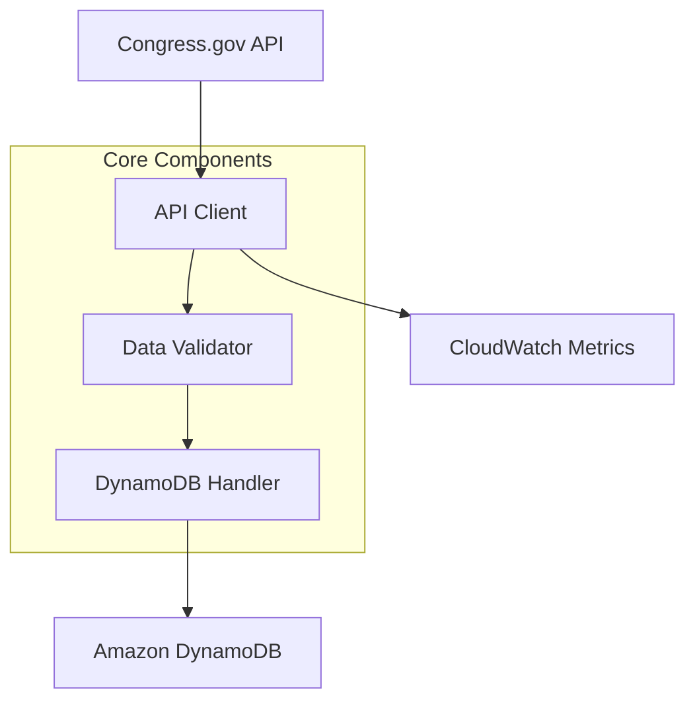
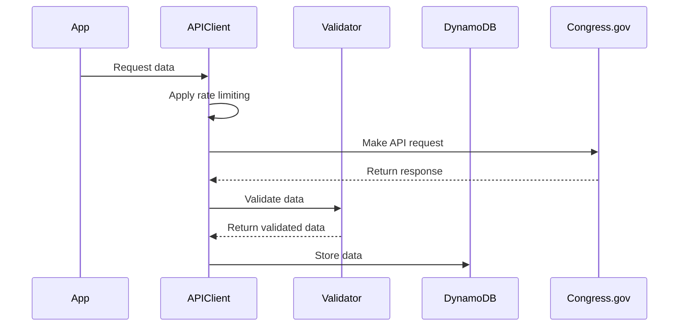
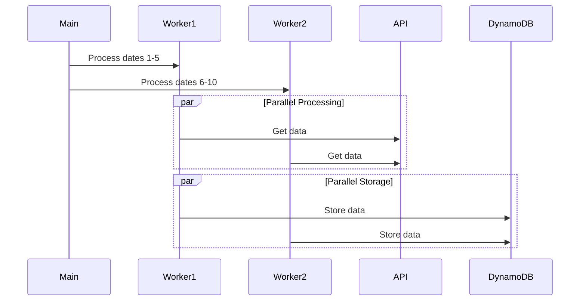

# Architecture Overview

## System Design

The Congress Data Downloader is a Python-based service designed to efficiently download and store legislative data from Congress.gov. The architecture emphasizes reliability, scalability, and maintainability.



## Core Components

### 1. API Client (congress_api.py)
Manages all interactions with the Congress.gov API.

Key Features:
- Rate limiting with backoff
- Error handling
- Response transformation
- Request retries

```python
class CongressAPI:
    def __init__(self, config):
        self.base_url = config['base_url']
        self.rate_limit = config['rate_limit']
        self.session = self._setup_session()

    def get_data_for_date(self, date):
        """Fetch all data types for a specific date."""
        pass

    def _make_request(self, endpoint, params):
        """Make API request with rate limiting."""
        pass
```

### 2. Data Validator (data_validator.py)
Ensures data integrity and consistency.

Responsibilities:
- Schema validation
- Data normalization
- Error checking
- Type conversion

```python
class DataValidator:
    def validate_committee(self, committee):
        """Validate committee data structure."""
        pass

    def validate_hearing(self, hearing):
        """Validate hearing data structure."""
        pass
```

### 3. DynamoDB Handler (dynamo_handler.py)
Manages all database operations.

Features:
- Batch operations
- Error recovery
- Connection management
- Query optimization

```python
class DynamoHandler:
    def store_item(self, item):
        """Store single item in DynamoDB."""
        pass

    def batch_store_items(self, items):
        """Store multiple items in batches."""
        pass
```

### 4. Monitoring System (monitoring.py)
Tracks system health and performance.

Metrics:
- API response times
- Error rates
- Resource usage
- Operation counts

```python
class MetricsCollector:
    def track_api_request(self, endpoint, status, duration):
        """Track API request metrics."""
        pass

    def track_dynamo_operation(self, operation, success):
        """Track DynamoDB operation metrics."""
        pass
```

## Data Flow

### 1. API Request Flow


### 2. Parallel Processing


## Error Handling

### 1. API Errors
- Rate limit handling
- Network timeouts
- Invalid responses
- Authentication failures

```python
try:
    response = self._make_request(endpoint, params)
except RateLimitExceeded:
    self._handle_rate_limit()
except NetworkTimeout:
    self._handle_timeout()
```

### 2. Data Validation
- Schema validation
- Required fields
- Data type checking
- Format validation

```python
def validate_committee(self, committee):
    try:
        self._check_required_fields(committee)
        self._validate_types(committee)
        return True, None
    except ValidationError as e:
        return False, str(e)
```

### 3. Storage Errors
- Connection issues
- Capacity limits
- Batch failures
- Consistency errors

```python
def batch_store_items(self, items):
    try:
        with self.table.batch_writer() as batch:
            for item in items:
                batch.put_item(Item=item)
    except Exception as e:
        self._handle_batch_error(e, items)
```

## Performance Optimization

### 1. Caching
- API response caching
- Schema validation caching
- Configuration caching

```python
class ResponseCache:
    def get_cached_response(self, key):
        """Get cached API response."""
        pass

    def cache_response(self, key, response):
        """Cache API response."""
        pass
```

### 2. Batch Processing
- Optimized batch sizes
- Parallel processing
- Efficient retries

```python
def process_date_range(self, start_date, end_date):
    with ThreadPoolExecutor(max_workers=self.max_workers) as executor:
        chunks = self._chunk_dates(start_date, end_date)
        futures = [executor.submit(self._process_chunk, chunk) 
                  for chunk in chunks]
```

### 3. Resource Management
- Connection pooling
- Memory optimization
- CPU utilization

```python
class ResourceManager:
    def monitor_resources(self):
        """Monitor system resource usage."""
        pass

    def optimize_resources(self):
        """Optimize resource allocation."""
        pass
```

## Security

### 1. Authentication
- API key management
- AWS credentials
- Token rotation

### 2. Data Protection
- Encryption at rest
- Secure transmission
- Access control

### 3. Monitoring
- Security events
- Access logs
- Error tracking

## Future Extensibility

### 1. API Versioning
- Version compatibility
- Schema migration
- Feature deprecation

### 2. Storage Options
- Multiple backends
- Data archival
- Backup strategies

### 3. Monitoring
- Custom metrics
- Alert integration
- Dashboard creation