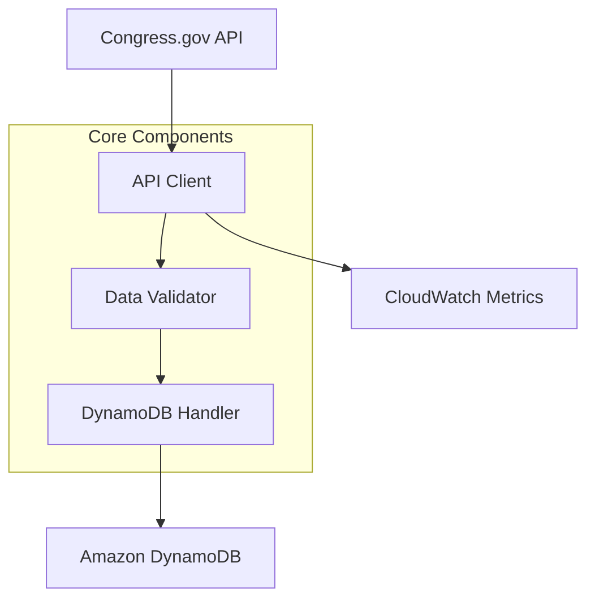
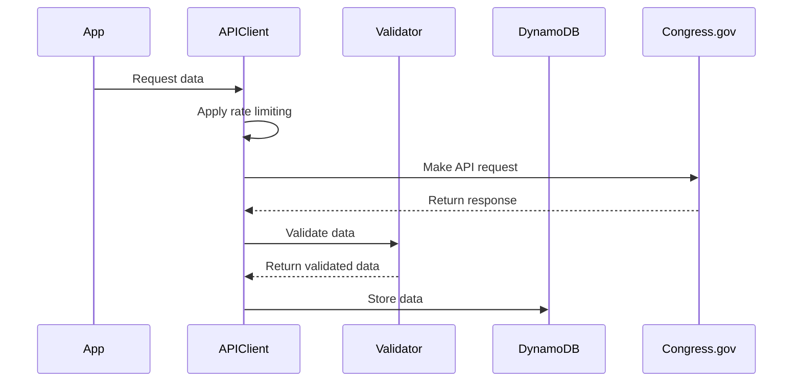
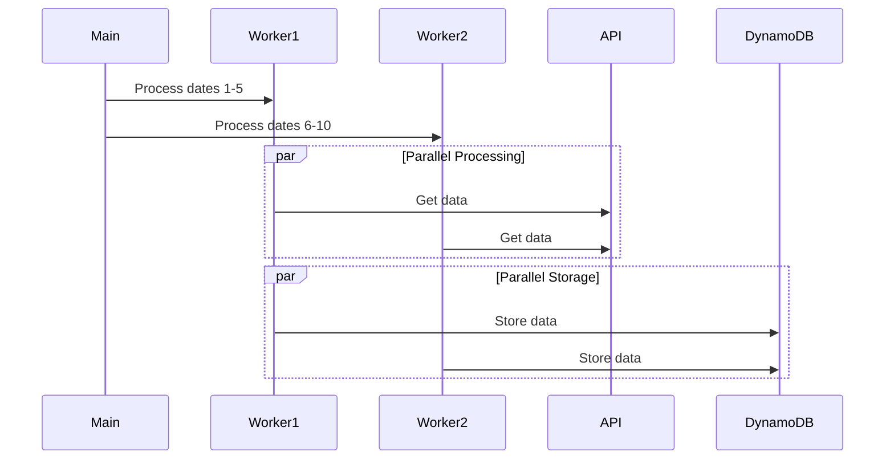
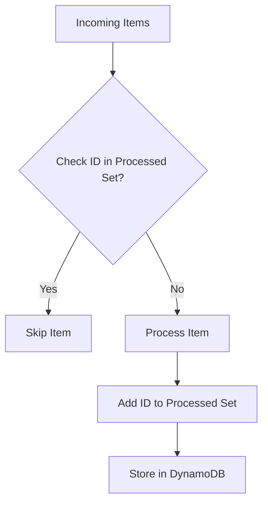

# Architecture Overview

## System Design

The Congress Data Downloader is a Python-based service designed to efficiently download and store legislative data from Congress.gov. The architecture emphasizes reliability, scalability, and maintainability.



## Core Components

### 1. API Client (congress_api.py)
Manages all interactions with the Congress.gov API.

Key Features:
- Rate limiting with backoff
- Error handling
- Response transformation
- Request retries

```python
class CongressAPI:
    def __init__(self, config):
        self.base_url = config['base_url']
        self.rate_limit = config['rate_limit']
        self.session = self._setup_session()

    def get_data_for_date(self, date):
        """Fetch all data types for a specific date."""
        pass

    def _make_request(self, endpoint, params):
        """Make API request with rate limiting."""
        pass
```

### 2. Data Validator (data_validator.py)
Ensures data integrity and consistency.

Responsibilities:
- Schema validation
- Data normalization
- Error checking
- Type conversion

```python
class DataValidator:
    def validate_committee(self, committee):
        """Validate committee data structure."""
        pass

    def validate_hearing(self, hearing):
        """Validate hearing data structure."""
        pass
```

### 3. DynamoDB Handler (dynamo_handler.py)
Manages all database operations.

Features:
- Batch operations
- Error recovery
- Connection management
- Query optimization
- Deduplication of records

```python
class DynamoHandler:
    def store_item(self, item):
        """Store single item in DynamoDB."""
        pass

    def batch_store_items(self, items):
        """Store multiple items in batches."""
        pass
```

### 4. Monitoring System (monitoring.py)
Tracks system health and performance.

Metrics:
- API response times
- Error rates
- Resource usage
- Operation counts
- Endpoint-specific statistics

```python
class MetricsCollector:
    def track_api_request(self, endpoint, status, duration):
        """Track API request metrics."""
        pass

    def track_dynamo_operation(self, operation, success):
        """Track DynamoDB operation metrics."""
        pass
```

## Data Flow

### 1. API Request Flow


### 2. Parallel Processing


## Error Handling

### 1. API Errors
- Rate limit handling
- Network timeouts
- Invalid responses
- Authentication failures

```python
try:
    response = self._make_request(endpoint, params)
except RateLimitExceeded:
    self._handle_rate_limit()
except NetworkTimeout:
    self._handle_timeout()
```

### 2. Data Validation
- Schema validation
- Required fields
- Data type checking
- Format validation

```python
def validate_committee(self, committee):
    try:
        self._check_required_fields(committee)
        self._validate_types(committee)
        return True, None
    except ValidationError as e:
        return False, str(e)
```

### 3. Storage Errors
- Connection issues
- Capacity limits
- Batch failures
- Consistency errors

```python
def batch_store_items(self, items):
    try:
        with self.table.batch_writer() as batch:
            for item in items:
                batch.put_item(Item=item)
    except Exception as e:
        self._handle_batch_error(e, items)
```

## Performance Optimization

### 1. Caching
- API response caching
- Schema validation caching
- Configuration caching

```python
class ResponseCache:
    def get_cached_response(self, key):
        """Get cached API response."""
        pass

    def cache_response(self, key, response):
        """Cache API response."""
        pass
```

### 2. Batch Processing
- Optimized batch sizes
- Parallel processing
- Efficient retries

```python
def process_date_range(self, start_date, end_date):
    with ThreadPoolExecutor(max_workers=self.max_workers) as executor:
        chunks = self._chunk_dates(start_date, end_date)
        futures = [executor.submit(self._process_chunk, chunk) 
                  for chunk in chunks]
```

### 3. Resource Management
- Connection pooling
- Memory optimization
- CPU utilization

```python
class ResourceManager:
    def monitor_resources(self):
        """Monitor system resource usage."""
        pass

    def optimize_resources(self):
        """Optimize resource allocation."""
        pass
```

## Security

### 1. Authentication
- API key management
- AWS credentials
- Token rotation

### 2. Data Protection
- Encryption at rest
- Secure transmission
- Access control

### 3. Monitoring
- Security events
- Access logs
- Error tracking

## Future Extensibility

### 1. API Versioning
- Version compatibility
- Schema migration
- Feature deprecation

### 2. Storage Options
- Multiple backends
- Data archival
- Backup strategies

### 3. Monitoring
- Custom metrics
- Alert integration
- Dashboard creation

## Deduplication Mechanism

The Congress Data Downloader implements a robust deduplication strategy to prevent duplicate items from being stored in DynamoDB. This is crucial for efficiency and preventing errors when processing data from the Congress.gov API.

### Deduplication Strategy



### Implementation Details

1. **Processed Items Tracking**
   - The `DynamoHandler` maintains an in-memory set `processed_item_ids` to track item IDs that have already been processed
   - This set is checked before attempting to write any item to DynamoDB

```python
def batch_store_items(self, items):
    # First, deduplicate the input list based on item ID
    deduplicated_items = []
    item_ids_in_batch = set()

    for item in items:
        if 'id' not in item:
            continue

        item_id = item['id']
        # Skip if already processed in this session or in this batch
        if item_id in self.processed_item_ids or item_id in item_ids_in_batch:
            self.logger.debug(f"Skipping duplicate item with ID: {item_id}")
            duplicate_items += 1
            continue

        deduplicated_items.append(item)
        item_ids_in_batch.add(item_id)
```

2. **Lifecycle Management**
   - The set is reset at strategic points to prevent memory bloat:
     - At the beginning of processing a new date range
     - When processing a new date chunk
     - When starting a bulk download

```python
def process_date_chunk(api_client, db_handler, dates, logger):
    for date in dates:
        try:
            # Reset processed IDs tracking for each date
            db_handler.reset_processed_ids()
            # Process date...
```

3. **Metrics and Reporting**
   - Duplicate detection is tracked and reported for monitoring
   - The system tracks:
     - Total items processed
     - Duplicate items skipped
     - Successful items stored
     - Failed items

### Benefits

1. **Error Prevention**: Prevents "Duplicate Key" errors from DynamoDB
2. **Performance**: Reduces unnecessary write operations
3. **Cost Efficiency**: Minimizes DynamoDB write units consumed
4. **Consistency**: Ensures each unique item is stored only once

## Enhanced Error Handling

The system implements a sophisticated error handling strategy to ensure reliability when interacting with the Congress.gov API.

### Rate Limiting with Adaptive Backoff

The `RateLimiter` class implements intelligent rate limiting with:

1. **Endpoint-specific Rate Limits**
   - Different endpoints have tailored request rates
   - High-volume endpoints (bill, amendment) have more conservative limits

2. **Dynamic Health Tracking**
   - Endpoints experiencing errors have their request rates automatically reduced
   - System tracks error rates per endpoint to adjust accordingly

3. **Exponential Backoff with Jitter**
   - Failed requests trigger increasing backoff periods
   - Random jitter prevents thundering herd problem

```python
def wait(self, endpoint):
    # Base wait time with endpoint-specific adjustment
    base_wait = 1.0 / self.get_rate_limit(endpoint)

    # Add jitter
    jitter = uniform(-0.15 * base_wait, 0.15 * base_wait)
    wait_time = max(0, base_wait + jitter)

    # Get health factor for endpoint
    health_factor = self.get_health_factor(endpoint)
    if health_factor > 1.0:
        wait_time *= health_factor

    # Apply exponential backoff if there were errors
    error_count = self.consecutive_errors.get(endpoint, 0)
    if error_count > 0:
        backoff_multiplier = min(2 ** (error_count + 1), 120)
        wait_time *= backoff_multiplier
```

### Enhanced HTTP Request Handling

1. **Adaptive Timeouts**
   - Timeouts are configured per endpoint type
   - Larger response endpoints (bills, amendments) have longer timeouts

2. **Comprehensive Error Classification**
   - Network errors are classified and logged specifically
   - Timeout errors distinguish between connection and read timeouts
   - Rate limit responses honor Retry-After headers with jitter

3. **Detailed Response Logging**
   - Success responses include timing and size metrics
   - Error responses include detailed status and headers
   - All metrics are tracked for reporting and troubleshooting

## Metrics and Reporting

The enhanced monitoring system provides comprehensive metrics about system operation:

### API Statistics

1. **Per-endpoint metrics**
   - Request counts and rates
   - Success/failure counts and rates
   - Average response times
   - Rate limit waits
   - Error counts by type

2. **Overall system metrics**
   - Total requests processed
   - Error rates
   - System uptime
   - Resource utilization

### Ingestion Statistics

1. **Per-endpoint ingestion metrics**
   - Items successfully stored
   - Duplicate items detected
   - Failed items
   - Storage timing

2. **Detailed Reports**
   - Human-readable summaries of API and ingestion metrics
   - Success rates by endpoint
   - Error breakdowns
   - Performance indicators

```python
def generate_api_metrics_report(self):
    """Generate a detailed report on API usage metrics"""
    report_lines = ["API METRICS REPORT"]
    report_lines.append("=" * 80)
    report_lines.append(f"Session duration: {self._format_duration(time.time() - self.session_start_time)}")
    report_lines.append("")

    # Add endpoint summary
    report_lines.append("ENDPOINT STATISTICS")
    report_lines.append("-" * 80)
    report_lines.append(f"{'Endpoint':<25} {'Requests':<10} {'Success':<10} {'Failures':<10} {'Rate Limits':<12} {'Avg Duration':<15}")
    report_lines.append("-" * 80)

    # ... generate detailed metrics
```

## Troubleshooting Guide

### Common Issues

1. **Rate Limit Errors**
   - Symptoms: HTTP 429 responses, increasing backoff times
   - Solutions:
     - Reduce parallel workers
     - Decrease requests_per_second in config
     - Space out data collection over time

2. **DynamoDB Capacity Errors**
   - Symptoms: ProvisionedThroughputExceeded errors
   - Solutions:
     - Increase table capacity
     - Implement additional batch retries
     - Add randomized exponential backoff

3. **Timeout Errors**
   - Symptoms: Read timeout or connection timeout errors
   - Solutions:
     - Check network connectivity
     - Increase endpoint timeout in configuration
     - Verify API endpoint health

### Monitoring Best Practices

1. **Regular Health Checks**
   - Run health_check.py daily to verify all endpoints
   - Review error logs and metrics
   - Monitor DynamoDB capacity utilization

2. **Metrics Review**
   - Track API request success rates over time
   - Monitor for endpoint degradation
   - Watch for increasing error rates

3. **Alerting**
   - Set up alerts for:
     - High error rates (>10%)
     - Excessive rate limiting
     - DynamoDB capacity warnings