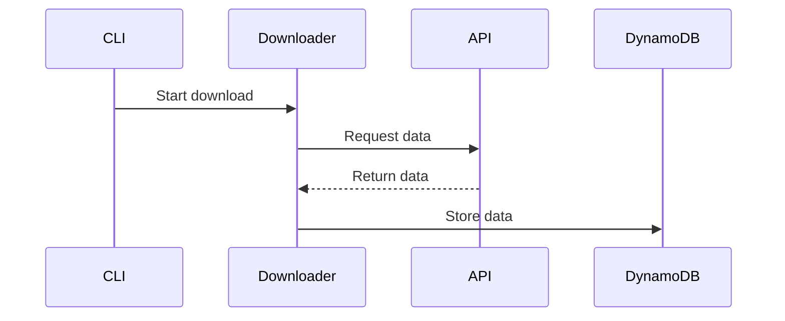

graph LR
    A[Congress.gov API] <--> B[Congress Downloader]
    B <--> C[Amazon DynamoDB]
    B --> D[Amazon CloudWatch]
```

## Core Components

### 1. Congress Downloader (congress_downloader.py)
- Main application entry point
- Handles command-line arguments
- Orchestrates the download process
- Manages parallel processing
- Implements graceful shutdown

Key responsibilities:
```python
def main():
    # Parse arguments
    # Initialize components
    # Execute download mode
    # Handle cleanup
```

### 2. Congress API Client (congress_api.py)
- Manages Congress.gov API interactions
- Implements rate limiting
- Handles authentication
- Transforms API responses

Key features:
```python
class CongressAPI:
    def get_data_for_date(self, date)
    def _rate_limit_wait(self)
    def _make_request(self, endpoint, params)
```

### 3. DynamoDB Handler (dynamo_handler.py)
- Manages DynamoDB operations
- Handles table creation and verification
- Implements batch operations
- Provides error handling

Core functionality:
```python
class DynamoHandler:
    def store_item(self, item)
    def batch_store_items(self, items)
    def query_by_date_range(self, start, end)
```

### 4. Data Validator (data_validator.py)
- Validates API responses
- Ensures data integrity
- Transforms and normalizes data

Validation process:
```python
class DataValidator:
    def validate_bill(self, bill)
    def validate_sponsor(self, sponsor)
    def validate_committee(self, committee)
```

### 5. Monitoring System (monitoring.py)
- Collects performance metrics
- Tracks resource usage
- Reports to CloudWatch
- Provides operation insights

Metrics collection:
```python
class MetricsCollector:
    def track_api_request(self, endpoint, status, duration)
    def track_dynamo_operation(self, operation, success)
    def track_resource_usage(self)
```

## Data Flow

### 1. Initial Request


### 2. Parallel Processing
```mermaid
sequenceDiagram
    participant Main
    participant Worker1
    participant Worker2
    participant Worker3
    participant API
    participant DynamoDB

    Main->>Worker1: Process chunk 1
    Main->>Worker2: Process chunk 2
    Main->>Worker3: Process chunk 3

    par Parallel Processing
        Worker1->>API: Get data
        Worker2->>API: Get data
        Worker3->>API: Get data
    end

    par Parallel Storage
        Worker1->>DynamoDB: Store data
        Worker2->>DynamoDB: Store data
        Worker3->>DynamoDB: Store data
    end