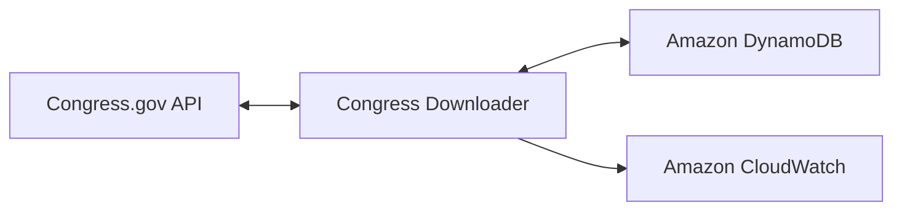
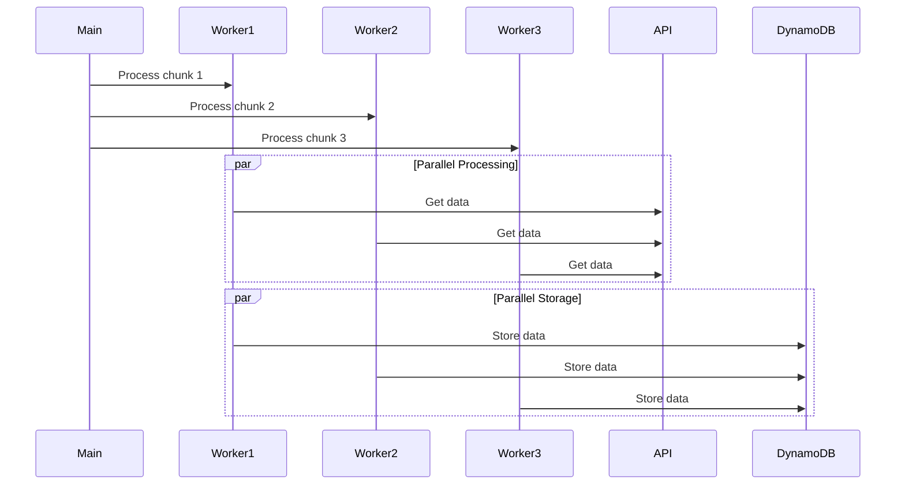

# Architecture Overview

## System Architecture

The Congress Data Downloader is built with a modular architecture focusing on reliability, scalability, and maintainability. Below is the high-level system diagram:



## Core Components

### 1. Congress Downloader (congress_downloader.py)
- Main application entry point
- Handles command-line arguments
- Orchestrates the download process
- Manages parallel processing
- Implements graceful shutdown

Key responsibilities:
```python
def main():
    # Parse arguments
    # Initialize components
    # Execute download mode
    # Handle cleanup
```

### 2. Congress API Client (congress_api.py)
- Manages Congress.gov API interactions
- Implements rate limiting
- Handles authentication
- Transforms API responses

Key features:
```python
class CongressAPI:
    def get_data_for_date(self, date)
    def _rate_limit_wait(self)
    def _make_request(self, endpoint, params)
```

### 3. DynamoDB Handler (dynamo_handler.py)
- Manages DynamoDB operations
- Handles table creation and verification
- Implements batch operations
- Provides error handling

Core functionality:
```python
class DynamoHandler:
    def store_item(self, item)
    def batch_store_items(self, items)
    def query_by_date_range(self, start, end)
```

### 4. Data Validator (data_validator.py)
- Validates API responses
- Ensures data integrity
- Transforms and normalizes data

Validation process:
```python
class DataValidator:
    def validate_bill(self, bill)
    def validate_sponsor(self, sponsor)
    def validate_committee(self, committee)
```

### 5. Monitoring System (monitoring.py)
- Collects performance metrics
- Tracks resource usage
- Reports to CloudWatch
- Provides operation insights

Metrics collection:
```python
class MetricsCollector:
    def track_api_request(self, endpoint, status, duration)
    def track_dynamo_operation(self, operation, success)
    def track_resource_usage(self)
```

## Data Flow

### 1. Initial Request


### 2. Parallel Processing


## Error Handling

1. **API Rate Limiting**
   - Exponential backoff
   - Request queuing
   - Automatic retries

2. **Data Validation**
   - Schema validation
   - Data normalization
   - Error reporting

3. **Storage Operations**
   - Batch operation retries
   - Conditional writes
   - Error recovery

## Performance Optimization

1. **Parallel Processing**
   - Configurable worker count
   - Chunk-based processing
   - Resource monitoring

2. **Caching**
   - API response caching
   - Schema validation caching
   - Configuration caching

3. **Batch Operations**
   - Optimized batch sizes
   - Automatic batch splitting
   - Failed item retry

## Security Considerations

1. **API Authentication**
   - Secure key storage
   - Request signing
   - Rate limit compliance

2. **Data Storage**
   - Encryption at rest
   - Access control
   - Audit logging

3. **Monitoring**
   - Error tracking
   - Performance metrics
   - Resource utilization

## Configuration Management

1. **Environment Variables**
   - Credential management
   - Runtime configuration
   - Feature flags

2. **Application Config**
   - Date range settings
   - Performance tuning
   - Logging configuration

## Future Extensibility

1. **API Versioning**
   - Version compatibility
   - Schema migration
   - Feature deprecation

2. **Data Storage**
   - Multiple storage backends
   - Data archival
   - Backup strategies

3. **Monitoring**
   - Custom metrics
   - Alert integration
   - Dashboard creation